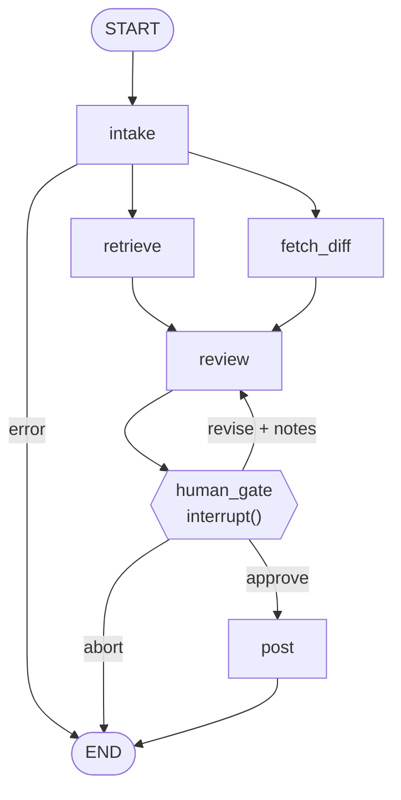

# QA Verdict Agent

An agent for any team with a ticket board: when a card hits **Ready for QA**, it opens an
episode, gathers the team's runbook (RAG) and the code diff (tool), reviews the diff
against the ticket's acceptance criteria, drafts a structured per-AC verdict — then
**stops and asks a human** before posting anything back to the board. Episodes survive a
process kill and resume exactly where they left off.

This is a clean-room, fictional-data reimagining of a QA system I run in production, and
it runs in two tiers on purpose. The **lab**: a small imaginary order-management service
("Orderly") with 10 designed tickets — failure modes engineered to be CI-green-but-wrong,
with known expected outcomes so the eval has ground truth and reviewers can run
everything locally with three API keys and zero external services. The **field**: the
same graph pointed at a real GitHub repo via the board port (see *Field test* below),
because a lab result you can't take outside the lab isn't much of a result.

## Quickstart

```bash
make setup          # uv sync + .env from template — fill in your keys
make run TICKET=QA-103
# ... graph pauses at the human gate with a draft verdict ...
make resume TICKET=QA-103 DECISION=revise NOTES="state the correctly-rounded value"
make resume TICKET=QA-103 DECISION=approve
make test
make eval           # push dataset + run the LangSmith experiment
```

Requires `uv`, `ANTHROPIC_API_KEY` (review model), `OPENAI_API_KEY` (embeddings + eval
judge), `LANGSMITH_API_KEY` (tracing + evals). The kill/resume demo is literally
`make run`, `kill -9` it mid-review, `make run` again — it continues from the checkpoint.

**Always-on mode:** `make watch` polls the board and opens an episode the moment a card
becomes ready — label a GitHub issue `ready-for-qa` and watch the agent pick it up,
review it, and park at the gate; any number of episodes can wait on human decisions
concurrently (one checkpointer thread each). Polling is the local stand-in for a
PR-opened webhook; a webhook receiver would invoke the same code path.

**Real board, optional:** set `QA_BOARD=github`, `QA_BOARD_REPO=owner/name`, and
`GITHUB_TOKEN` and the same graph runs against live GitHub Issues — ticket id = issue
number (`make run TICKET=24`), a `ready-for-qa` label gates intake, ACs parse from a
checklist section, and the approved verdict posts back as an issue comment with the
audit footer. Set `QA_REPO_DIR=/path/to/checkout` and the review tool reads that real
working tree instead of the fixture app. The file board stays the zero-key default; no
node knows the difference — that's the port doing its job.

## The graph



| Node | Responsibility |
|---|---|
| `intake` | Load the card via the board port, normalize ACs, redact PII **before** anything enters state |
| `retrieve` | RAG over the team knowledge base (runbook, testing conventions, definition of done) |
| `fetch_diff` | Pull the code diff via the diff-source port |
| `review` | LLM judges each AC (pass / fail / unclear) with cited evidence; may read up to 2 files beyond the diff |
| `human_gate` | `interrupt()` — a human approves, requests revision with notes, or aborts |
| `post` | Post the approved verdict back to the board |

`retrieve` and `fetch_diff` run in parallel (they write disjoint state keys); `review` is
the fan-in. The revise loop has no attempt cap — the human is the cap.

## Field test: a real project

The fixtures prove the designed behaviors; a live run against a real, active product repo
(private — shown in the demo video) proved the system outside its own sandbox:

- **A real ticket, validated.** "Readable currency formatting for price displays" was
  filed as a GitHub issue with ACs, implemented on a branch of that project, and the
  agent reviewed the actual branch diff — `get_file_context` reading the project's real
  working tree via `QA_REPO_DIR`. The draft verdict passed all three ACs with evidence
  from the real files, and volunteered an advisory no AC asked about: `toLocaleString`
  output varies under trimmed-ICU Node builds — a genuine CI footgun, correctly kept
  advisory rather than failed.
- **A card became ready; nobody ran a command.** With `make watch` polling, adding the
  `ready-for-qa` label to a second issue in the browser was the entire trigger: the agent
  picked it up unprompted, reviewed it, caught an off-by-one against an AC's boundary
  ("10 or more" vs `> 10`, plus the untested boundary the team's conventions require),
  and parked at the human gate. Approval posts the verdict back to the issue.

The contract that makes an issue reviewable:

```markdown
## Acceptance Criteria
- [ ] AC-1: Orders with 10 or more total items ship free regardless of subtotal.
- [ ] AC-2: The existing $100-subtotal free-shipping rule still applies.

Diff-Ref: QA-109.diff
```

(`Diff-Ref` points at a locally exported diff today; pulling the diff straight from the
PR via the compare API is the listed next step, and the PR-opened webhook replaces the
polling loop — same graph either way.)

## Design notes

**Determinism everywhere; agency only where it earns its keep — and there, bounded.**
The graph is a deterministic workflow. The one place with model agency is inside the
review node: the LLM may call `get_file_context(path)` at most twice to read repository
files when a diff alone can't verify an AC, then must produce its verdict. The budget is
enforced inside the tool (an over-budget call returns "judge with what you have"), paths
are resolved strictly inside the repo root (tool-call boundary = security boundary), and
every file actually read is recorded in state as `consulted` — the CLI shows it, and the
posted verdict carries it, so every verdict is auditable.

**The LLM makes small judgments; code makes the big one.** The model only produces
per-AC statuses with cited evidence. The `overall` verdict is computed deterministically
(any fail → fail, else any unclear → needs_info, else pass), coverage is enforced in code
(a skipped AC becomes `unclear`, hallucinated AC ids are dropped), and there is
deliberately no self-reported confidence score anywhere.

**ACs ride on the card; RAG carries shared knowledge.** Retrieving ticket-specific facts
by similarity search is a key lookup in a vector costume — its failure mode (silently
pulling another ticket's ACs) is severe. The knowledge base holds what semantic retrieval
is actually for: the runbook, testing conventions, and definition of done. It's
load-bearing, provably: ticket QA-103's verdict flips from pass to fail only when the
retrieved money-handling rule is in context.

**PII never touches disk.** Redaction happens inside `intake`, before ticket text enters
graph state — so the checkpoint DB, the LLM prompts, and the LangSmith traces only ever
see scrubbed text. The redaction log records entity types and counts, never values. (A
separate redact node would checkpoint raw PII between nodes — that's why it isn't one.)

**Static review, on purpose.** Nothing here executes code — the diff, and even the test
files inside it, are judged as text. That is not a weakness dressed up as a choice: every
designed-fail fixture in `data/tickets/` is CI-green by construction (QA-103's test
*enshrines* its bug by asserting the truncated value). CI answers "does the code do what
the author intended?"; this system answers "does the change do what the ticket asked?" —
CI is structurally blind to the author's blind spots, which is where QA findings live.
Execution is an evidence source, not the system's identity: a `TestRunner` port feeding
run results into the same judgment layer is the first improvement I'd build.

**What LangGraph bought, and cost.** Bought: checkpoint/resume for free (the hardest part
of the hand-rolled production version this is modeled on), `interrupt()` as a first-class
pause instead of a job queue with resume tokens, time-travel debugging, and traces that
fall out of the ecosystem. Cost: API churn across versions (idioms verified against
current docs, versions pinned), serialization discipline in state design, and superstep
semantics that leak into node design — code before `interrupt()` re-runs on resume, which
is why the gate node is four lines. Honest answer included: at exactly this scale, a
linear pipeline with one gate could be a while-loop; the framework earns its keep at many
episode types, replay/audit requirements, and multi-step human workflows.

## Evals

The unit under eval is the **review step** — dataset inputs are built by the same
intake/retrieve/fetch functions production uses; expected outcomes live in
`data/expected/verdicts.json`, which agent nodes never read. Three evaluators: exact-match
on the overall verdict, per-AC status accuracy, and an LLM judge on reasoning quality —
**cross-family** (GPT judges Claude), so the system never grades its own homework.

Results over the 10-ticket fixture set, comparing the review node's two modes:

| metric | tool mode (default) | single structured call |
|---|---|---|
| overall verdict exact | **1.00** | 0.70 |
| per-AC status accuracy | **1.00** | 0.80 |
| judge: reasoning quality | **1.00** | 0.80 |

Single mode's three misses are exactly the tickets whose verification requires code
outside the diff (QA-105, QA-106, QA-108) — which tool mode resolves within its 2-call
budget. The eval didn't just score the system; it located precisely where agency was
needed, and how much.

Honesty note: 1.00 is on 10 curated fixtures after three calibration iterations (each
triggered by a real failure trace — an AC that under-specified a contract change, a
fixture with a genuine float-rounding bug the model caught, a judge that couldn't see the
files the reviewer consulted). The claim is that the failure-trace loop converges, not a
production accuracy number. In production the flywheel continues: every human `revise` at
the gate is a labeled disagreement — the next dataset example.

## What I'd improve with more time

- **TestRunner port**: execute the ticket's test suite (pytest, Playwright, whatever the
  stack runs) and feed results into review as another evidence source — including "this
  AC has no covering test; here's the one I'd write."
- Auto-approve above a per-AC-unanimity bar, with sampled human audit.
- Presidio NER redaction behind the same `redact()` signature (names are out of regex's
  reach).
- Real diffs (GitHub compare API) behind the `DiffSource` port — the board half is done
  (GitHub Issues adapter, live-demonstrated); a Trello adapter would follow the same
  two-method contract.
- `make eval` in CI: fail the PR on regression against the baseline experiment.
- Episode UUIDs (currently one live episode per ticket — thread_id = ticket_id).
- A PR-open trigger (GitHub App or Actions): the graph is already trigger-agnostic, but a
  gated episode opened in CI needs the Postgres checkpointer so the interrupt survives the
  runner and a human can resume it anywhere — same `compile()` call, different saver.

## Demo

<!-- TODO(zach): video link — kill/resume, revise loop, tool call on QA-105,
     redaction on QA-108, eval run. Script in notes/demo-script.md. -->
